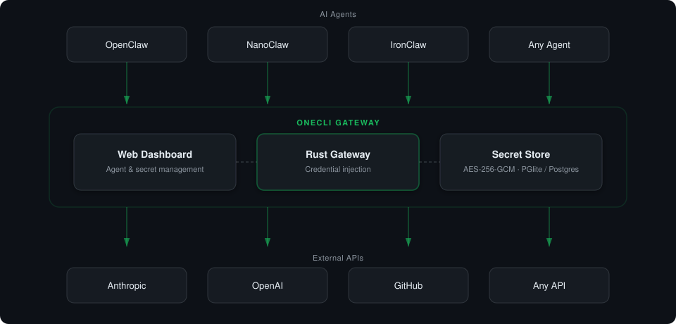

<div align="center">


**The privacy-first credential gateway and isolation proxy for AI agents.**
Store once. Inject at the network layer. Intercept securely. AI agents never see your actual API keys.

[](https://www.rust-lang.org/)
[](https://nextjs.org/)
[](https://www.typescriptlang.org/)
[](https://www.prisma.io/)
[](https://www.postgresql.org/)
[](https://www.docker.com/)
[](https://github.com)

[**Website**](https://agent-vault-cli-web.vercel.app/)

</div>


---

> *OneCLI-AgentVault is the ultimate trust and security layer for AI coding agents (like Cursor, Claude Code) and autonomous workflows (n8n, Dify).*

- **Why it matters:** AI agents write and execute code natively in local terminals, but giving them raw credentials is a major liability. Prompt injection can trigger malicious actions, or a loop bug can wipe out databases/emails. OneCLI-AgentVault intercepts all traffic at the network layer to prevent credential leaks, restrict malicious endpoints (like blocking `DELETE` requests), and enforce strict rate limits.

---

## What is OneCLI-AgentVault?

OneCLI-AgentVault is an open-source gateway that sits between your AI agents and the services they call. Instead of baking API keys into every agent, you store credentials once in OneCLI-AgentVault, and the gateway injects them transparently. Agents never see the secrets.

**Why we built it:** AI agents need to call dozens of APIs, but giving each agent raw credentials is a security risk. OneCLI-AgentVault solves this with a single gateway that handles auth, so you get one place to manage access, rotate keys, and see what every agent is doing.

**How it works:** You store your real API credentials in OneCLI-AgentVault and give your agents placeholder keys (e.g. `FAKE_KEY`). When an agent makes an HTTP call through the gateway, OneCLI-AgentVault matches the request to the right credentials, decrypts them, and injects them in place of the `FAKE_KEY` into the outbound request. The agent never touches the real secrets — it just makes normal HTTP calls, and the gateway handles the swap.

---

## Architecture

<picture>
  <source media="(prefers-color-scheme: dark)" srcset="assets/onecli-architecture-dark.svg">
  <source media="(prefers-color-scheme: light)" srcset="assets/onecli-architecture-light.svg">
  
</picture>

| Component | Role |
|---|---|
| **[Rust Gateway](apps/gateway)** | Fast HTTP gateway that intercepts outbound requests and injects credentials. Agents authenticate with access tokens via `Proxy-Authorization` headers. |
| **[Web Dashboard](apps/web)** | Next.js app for managing agents, secrets, and permissions. Provides the API the gateway uses to resolve which credentials to inject for each request. |
| **Secret Store** | AES-256-GCM encrypted credential storage. Secrets are decrypted only at request time, matched by host and path patterns, and injected by the gateway as headers or URL query parameters. |

---

##  Tech Stack

OneCLI-AgentVault is built using a modern, performant, and type-safe stack:

| Core Technology | Description |
|---|---|
|  | High-performance MITM interception proxy engine |
|  | Dashboard UI & configuration API management |
|  | Type-safe client and API route coordination |
|  | Modern database toolkit and object-relational mapping |
|  | Secure persistent storage for agent configuration |
|  | Containerized local environment and deployment runtime |
|  | High-end visual aesthetics and dark mode implementation |

---

## Quick Start

If you prefer to run it manually:

```bash
git clone https://github.com/manishpatel00/Onecli-AgentVault.git
cd Onecli-AgentVault
docker compose -f docker/docker-compose.yml up -d --wait
```

Open **http://localhost:10254**, create an agent, add your secrets, and point your agent's HTTP gateway to `localhost:10255`.

> The Quick Start runs OneCLI in **local mode** (single-user, no login), so no `.env` or `NEXTAUTH_SECRET` is required. To enable Google OAuth for multiple users, set `NEXTAUTH_SECRET` and the Google credentials (see [Configuration](#configuration)).

## Features

- **Transparent credential injection**: agents make normal HTTP calls, the gateway handles auth
- **Encrypted secret storage**: AES-256-GCM encryption at rest, decrypted only at request time
- **Host & path matching**: route secrets to the right API endpoints with pattern matching
- **Multi-agent support**: each agent gets its own access token with scoped permissions
- **Easy setup**: `curl -fsSL https://onecli.sh/install | sh` starts everything (app + PostgreSQL)
- **Two auth modes**: single-user (no login) for local use, or Google OAuth for teams
- **Rust gateway**: fast, memory-safe HTTP gateway with MITM interception for HTTPS
- **[Vault integration](docs/vault-integration.md)**: connect Bitwarden (or other password managers) for on-demand credential injection without storing secrets on the server

## Project Structure

```
apps/
  web/            # Next.js app (dashboard + API, port 10254)
  gateway/        # Rust gateway (credential injection, port 10255)
packages/
  db/             # Prisma ORM + migrations
  ui/             # Shared UI components (shadcn/ui)
docker/
  Dockerfile      # App image (gateway + web)
  docker-compose.yml
```

## Local Development

### Prerequisites

- **[mise](https://mise.jdx.dev)** (installs Node.js, pnpm, and other tools)
- **Rust** (for the gateway)
- **Docker** (for PostgreSQL)

### Setup

```bash
mise install
pnpm install
cp .env.example .env
pnpm db:generate
pnpm db:up          # Start PostgreSQL
pnpm db:migrate     # Apply migrations
pnpm dev
```

Dashboard at **http://localhost:10254**, gateway at **http://localhost:10255**.

### Commands

| Command            | Description                     |
| ------------------ | -------------------------------- |
| `pnpm dev`         | Start web + gateway in dev mode |
| `pnpm build`       | Production build                |
| `pnpm check`       | Lint + types + format           |
| `pnpm db:up`       | Start PostgreSQL (Docker)       |
| `pnpm db:down`     | Stop PostgreSQL                 |
| `pnpm db:generate` | Generate Prisma client          |
| `pnpm db:migrate`  | Run database migrations         |
| `pnpm db:studio`   | Open Prisma Studio              |

## Configuration

All environment variables are optional for local development:

| Variable                | Description                       | Default            |
| ------------------------ | ---------------------------------- | ------------------- |
| `DATABASE_URL`          | PostgreSQL connection string      | See `.env.example` |
| `NEXTAUTH_SECRET`       | Enables Google OAuth (multi-user) | Single-user mode   |
| `GOOGLE_CLIENT_ID`      | Google OAuth client ID            | —                  |
| `GOOGLE_CLIENT_SECRET`  | Google OAuth client secret        | —                  |
| `SECRET_ENCRYPTION_KEY` | AES-256-GCM encryption key        | Auto-generated      |

## Contributing

We welcome contributions! Please read our [Contributing Guide](CONTRIBUTING.md) and [Code of Conduct](CODE_OF_CONDUCT.md) before getting started.

## License

Licensed under the MIT License.

See the [LICENSE](LICENSE) file for details.

---

Built with ❤️ for the AI agent ecosystem.
